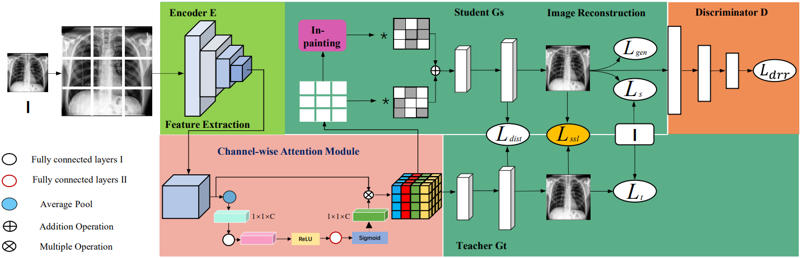

# HCASC

This study proposes a novel and effective harnessing channel-wise recalibration and structural consistency(CRSC) framework to detect anomalies in medical images. The proposed framework mainly includes a channel-wise recalibration module and a structural similarity loss module. The first module adjusts the weight of different medical image feature channels, enhancing the network’s representation and generalization capabilities. The latter is devoted to evaluating the loss function of similarity between two images and optimizing the model.

our method has achieved significant performance improvement (i.e,AUC gains of 3%) compared to the state-of-the-art (SOTA) methods.

<p align="center"></p>

## Paper


### **Our Results**

Our best Model  Results can be found in (1)https://drive.google.com/file/d/1vFB_4xTafpn2qjCPgBAgQuLBXC-pNHar/view?usp=drive_link，
                                        (2)https://drive.google.com/file/d/1XxRQTGDOxVylWlcOwrnJQPKOXFOjcqcr/view?usp=sharing

## Dependencies

Please clone our environment using the following command:

```
conda env create -f environment.yml
conda activate hcasc
```

## File Structures

* ```checkpoints/```: experiment folders, organized by unique exp identifier.
* ```dataloader/```: dataloaders for zhanglab and chexpert.
* ```models/```: models for HCASC
* ```configs/```: configure files for different experiments, based on the base configure class.


## Usage
### Data

**ZhangLab Chest X-ray**

Please download the offical training/testing and our validation splits from [google drive](https://drive.google.com/file/d/1kgYtvVvyfPnQnrPhhLt50ZK9SnxJpriC/view?usp=sharing), and unzip it to anywhere you like.

**Stanford ChexPert**

Please download the offical training/validation and our testing splits from [google drive](https://drive.google.com/file/d/14pEg9ch0fsice29O8HOjnyJ7Zg4GYNXM/view?usp=sharing), and unzip it to anywhere you like.


### Configs

Different experiments are controlled by configure files, which are in ```configs/```. 

All configure files are inherited from the base configure file: ```configs/base.py```, we suggest you to take a look at this base file first, and **change the dataset root path in your machine**.

Then, you can inherite the base configure class and change settings as you want. 

We provide our default configures for ZhangLab: ```configs/zhang_best.py```, CheXpert: ```configs/chexpert_best.py``` and ```configs/digit_best.py```.

The path to a configure file needs to be passed to the program for training.

### Train

Train with a configure file and a unique experiment identifier:

``` 
python3 main.py --exp zhang_exp1 --config zhang_best
```

Alternatively, you can modify ```run.sh``` and simply run:

```
./run.sh
```

### Evaluation


Evaluate with an exp identifier (config file will be imported from the *exp folder* instead):
``` 
python3 eval.py --exp zhang_exp1
```

Alternatively, you can modify ```eval.sh``` and simply run:
``` html
./eval.sh
```
